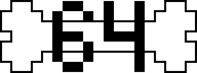
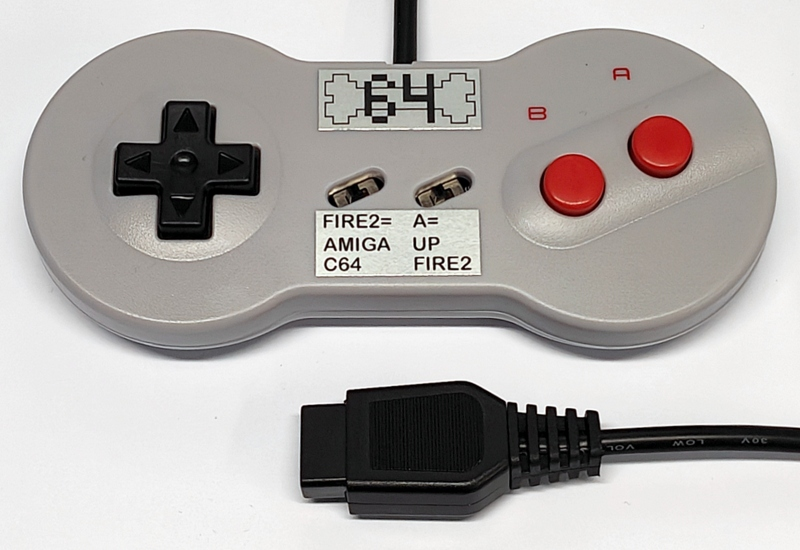
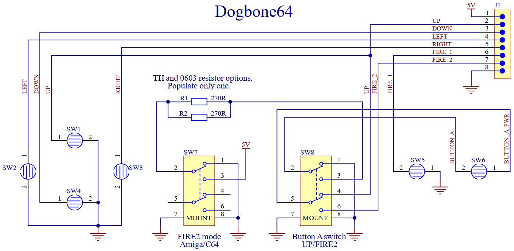
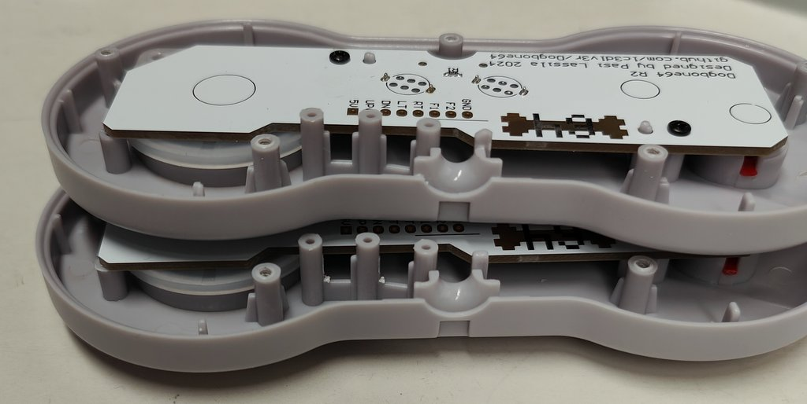
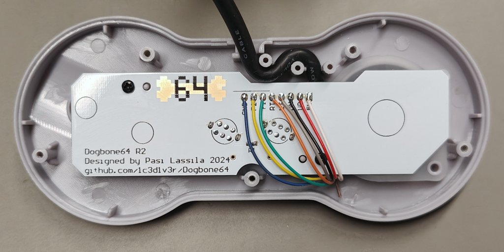

    

# Dogbone64
Replacement PCB for NES Dogbone controller. Amiga &amp; Commodore 64 compatible.

Right slide switch selects the functiuon of button A. If slide switch is up then button A is UP. If slide switch is down then button A is FIRE2.
Left slide switch selects FIRE2 compatibility. C64 requires connection to +5V. Amiga requires connection to GND. If slide switch is up then FIRE2 is Amiga compatible. If slide switch is down then FIRE2 is C64 compatible.
There are of course many other computers compatible with this controller. Check the support for FIRE2 and connection to +5V or GND.

Assembly instructions coming soon.

Image of first revision. Ugly labels made with a Brother label printer. I'm looking into ordering better labels.

    

## Bill of materials:

| Definition                      | Manufacturer  | Manufacturer PN  | Case/Package | Quantity | Designator | Link                                                                                                                                                 |
| ------------------------------- | ------------- | ---------------- | ------------ | -------- | ---------- | ---------------------------------------------------------------------------------------------------------------------------------------------------- |
| SWITCH SLIDE DPDT 6-TH          | C&K           | OS202011MS2QS1   | 6-TH         | 2        | SW7, SW8   | [https://www.digikey.com/en/products/detail/c-k/OS202011MS2QS1/1981415](https://www.digikey.com/en/products/detail/c-k/OS202011MS2QS1/1981415)       |
| SWITCH SLIDE DPDT 6-TH          | Made in China | SS-22D07         | 6-TH         | 2        | SW7, SW8   | [https://www.aliexpress.com/item/1005005780968309.html](https://www.aliexpress.com/item/1005005780968309.html)                                       |
| RES 270 OHM 1% 1/10W 0603       | Yageo         | RC0603FR-07270RL | 0603         | 1        | R1         | [https://www.digikey.com/en/products/detail/yageo/RC0603FR-07270RL/727103](https://www.digikey.com/en/products/detail/yageo/RC0603FR-07270RL/727103) |
| RES 270 OHM 5% 1W AXIAL         | Yageo         | FMP100JR-52-270R | TH           | 1        | R2         | [https://www.digikey.com/en/products/detail/yageo/FMP100JR-52-270R/2058596](https://www.digikey.com/en/products/detail/yageo/FMP100JR-52-270R/2058596) |
| Extensionb cable 9 pin 1.8m     | \-            | \-               | \-           | \-       | \-         | [https://www.aliexpress.com/item/1005002907097500.html](https://www.aliexpress.com/item/1005002907097500.html)                                       |
| Dogbone Classic Game Controller | \-            | \-               | \-           | \-       | \-         | [https://www.aliexpress.com/item/1005006436855182.html](https://www.aliexpress.com/item/1005006436855182.html)                                       |
| Screw Phillips self-tapping M2.3 5mm | \-       | \-               | \-           | 2        | \-         | [https://www.aliexpress.com/item/1005003934120055.html](https://www.aliexpress.com/item/1005003934120055.html)                                       |
| PCB                             | \-            | \-               | \-           | \-       | \-         | [https://jlcpcb.com/](https://jlcpcb.com/)                                                                                                           |

There are two options for the switches. Better quality C&K brand and lower quality Chinese version. Order only the other one.\
There are options for both SMD 0603 resistor R1 and through hole resistor R2. Assemble only R1 or R2. You may use any other same size resistor. The BOM order codes are just what I have added to my library.\
There are multiple options for the cable. I use the listed extension cables because they are the longest ones.\
The PCB has been tried to the controller model sold at Aliexpress. I also got a Retrobit brand USB version which also works with the PCB. The PCB has not been tried to an original Nintendo brand dogbone controller.\
The screws are optional but make the assembly easier.

## Schematic

    

## Gerber files
Gerber files for ordering the PCBs are available [HERE.](https://github.com/1c3d1v3r/Dogbone64/blob/main/gerbers/Dogbone64_R2_PCB.zip) 
I ordered with the same .zip package from JCLpcb. 
**Parameters:** 
PCB Thickness: 1.6mm 
Surface Finish: ENIG 
Via Covering: Tented 
PCB Remark: "There is silk on copper on purpose on the PCB art. Please do not cut away silk on copper." 

## Assembly

I cut the switch pins shorter so they don't protrude through the PCB. Otherwise they would touch the plastic on the bottom case.
The extension cables are thicker than the original cables. I cut some plastic to fit the thicker cable as seen in the lower controller case in the picture below.

    

There are may ways to route the cables. I pushed the cable between the top case and the PCB. There are black circles on the PCB. They show where there are plactics supports in the bottom case. Do not route wires over the circles to avoin pinching the wires.\
Use the picture as a guide for soldering the wires by colour. Both the extension cable and a replacemens controller cable I got from Aliexpress had the same colour coding. Brown wire is cut short and left unconnected. 

    

### Licence

Dogbone64 by <a rel="cc:attributionURL dct:creator" property="cc:attributionName" href="https://github.com/1c3d1v3r/">Pasi Lassila</a> is licensed under <a href="http://creativecommons.org/licenses/by-sa/4.0/?ref=chooser-v1" target="_blank" rel="license noopener noreferrer" style="display:inline-block;">CC BY-SA 4.0</a>

