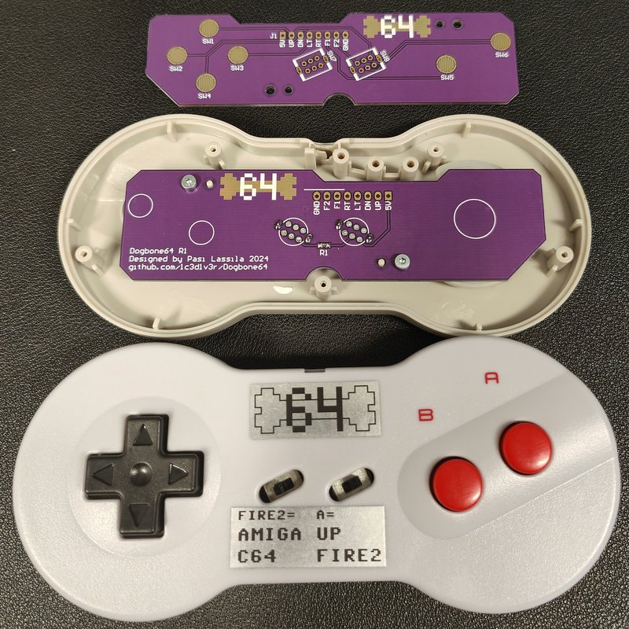

    

# Dogbone64
Replacement PCB for NES Dogbone controller. Amiga &amp; Commodore 64 compatible.\

Right slide switch selects the functiuon of button A. If slide switch is up then button A is UP. If slide switch is down then button A is FIRE2.
Left slide switch selects FIRE2 compatibility. C64 requires connection to +5V. Amiga requires connection to GND. If slide switch is up then FIRE2 is Amiga compatible. If slide switch is down then FIRE2 is C64 compatible.
There are of course many other computers compatible with this controller. Check the support for FIRE2 and connection to +5V or GND.

Schematic, gerber files and assembly instructions coming soon.
Image of first revision. Ugly labels made with a Brother label printer. I'm looking into ordering better labels.

    

    

Bill of materials:

| Definition                      | Manufacturer  | Manufacturer PN  | Case/Package | Quantity | Designator | Link                                                                                                                                                 |
| ------------------------------- | ------------- | ---------------- | ------------ | -------- | ---------- | ---------------------------------------------------------------------------------------------------------------------------------------------------- |
| SWITCH SLIDE DPDT 6-TH          | C&K           | OS202011MS2QS1   | 6-TH         | 2        | SW7, SW8   | [https://www.digikey.com/en/products/detail/c-k/OS202011MS2QS1/1981415](https://www.digikey.com/en/products/detail/c-k/OS202011MS2QS1/1981415)       |
| SWITCH SLIDE DPDT 6-TH          | Made in China | SS-22D07         | 6-TH         | 2        | SW7, SW8   | [https://www.aliexpress.com/item/1005005780968309.html](https://www.aliexpress.com/item/1005005780968309.html)                                       |
| RES 270 OHM 1% 1/10W 0603       | Yageo         | RC0603FR-07270RL | 0603         | 1        | R1         | [https://www.digikey.com/en/products/detail/yageo/RC0603FR-07270RL/727103](https://www.digikey.com/en/products/detail/yageo/RC0603FR-07270RL/727103) |
| Extensionb cable 9 pin 1.8m     | \-            | \-               | \-           | \-       | \-         | [https://www.aliexpress.com/item/1005002907097500.html](https://www.aliexpress.com/item/1005002907097500.html)                                       |
| Dogbone Classic Game Controller | \-            | \-               | \-           | \-       | \-         | [https://www.aliexpress.com/item/1005006436855182.html](https://www.aliexpress.com/item/1005006436855182.html)                                       |
| PCB                             | \-            | \-               | \-           | \-       | \-         | [https://jlcpcb.com/](https://jlcpcb.com/)                                                                                                           |

There are two options for the switches. Better quality C&K brand and lower quality Chinese version. Order only the other one. There are multiple options for the cable. I use the listed extension cables because they are the longest ones.\
The PCB has been tried to the controller model sold at Aliexpress. I also got a Retrobit brand USB version which also works with the PCB. The PCB has not been tried to an original Nintendo brand dogbone controller.
